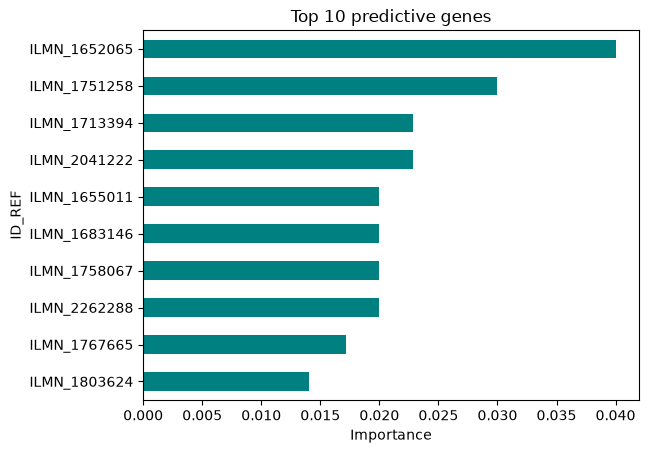

# MESENCHYMAL STEM CELLS VIABILITY PREDICTION

A real biomedical analitical project based on Machine Learning tools to analyze and predict cell viability and senescence in Mesenchymal Stem Cells using transcriptomic (microarray) data

## Objective
The main goal is to identify genetic biomarkers that act as strong predictors of cell viability (high-growth capacity vs. senescence) in MSC cultures. This project transitions from a high-dimensional problem to an interpretable predictive model, trying to use the most robust analytical methods acquired throughout my biomedical engineering degree, smoothly integrating them with modern data science tools (such as pandas) and advanced machine learning frameworks 

## Dataset
The clinical and genetic data were obtained from the NCBI's Gene Expression Omnibus (GEO) database:
*   **Link:** [GSE135401](https://www.ncbi.nlm.nih.gov/geo/query/acc.cgi?acc=GSE135401)
*   **Samples:** 12 independent bone marrow Mesenchymal Stem Cell cultures
*   **Original Features:** > 47,000 gene probes (Illumina expression beadchip)

## Project Structure
```text
mesenchymal-stem-cell-ml/
├── data/                   #raw files (GSE135401_series_matrix.txt.gz)
├── notebooks/              #jupyter notebook with the step-by-step analysis
│   └── final_code.ipynb
├── results/                #output plots and visualizations
│   ├── pca_results.png
│   └── top10_results.png
├── README.md               #project documentation
└── requirements.txt        #python dependencies for reproducibility
```

## Methodology and Results
1.  **Dimensionality reduction :** a strict variance filter (95th percentile) was applied to remove maintenance genes. This reduced the feature space from 47,322 down to 2,367 biomarker candidate genes
2.  **Training and validation:** due to the small sample size (n=12), a strict leave-one-out cross-validation approach was implemented to evaluate a Random Forest classifier algorithm
3.  **Performance:** the model achieved a **predictive accuracy of 91.6%**

## Key Conclusions
*   **Model robustness against high dimensionality:** despite the challenge of working with over 47,000 genes and only 12 samples, it was possible to eliminate the background noise of non-significant genes by using a strict variance filter. Combined with the Random Forest algorithm, this successfully mitigated overfitting
*   **Rigorous validation:** given the scarcity of samples, a leave-one-out cross-validation was used, achieving a predictive accuracy of 91.6%. This demonstrates a high capacity to generalize and correctly classify young versus senescent cells
*   **Interpretability:** the feature importance analysis allowed us to open the algorithm's black box. The top 10 main probes (led by 'ILMN_1652065' and 'ILMN_1751258') have been identified, acting as strong predictors of the cell viability state. These findings open the door to future in vitro biological validations to understand the underlying mechanisms of senescence in MSCs

### Top 10 Predictive Biomarkers
Through the model's Feature Importance analysis, the following differential genetic signature was isolated:

 

## Reflections & Future Directions
* Due to the small sample size (n=12), regularized linear models might be more robust than Random Forest. The next step is to benchmark this against Support Vector Machines (linear SVM) and Lasso Regression, which are ideal for high-dimensional datasets
* Perform in vitro lab validation of the top 10 genes (like via qPCR) on new MSC cultures, and run a Gene Ontology analysis to map the biological pathways involved in senescence

## Reproducibility
To reproduce this environment locally and run the analysis:

1. Clone this repository
2. Create a virtual environment: `python -m venv .venv`
3. Activate the environment and install the required dependencies:
   `pip install -r requirements.txt`
4. Open and run the notebooks in your preferred editor


## Author:
[Inés Paramio Quintanilla](https://www.linkedin.com/in/inés-paramio-quintanilla-a58a81296) :)

Thank you for reading!